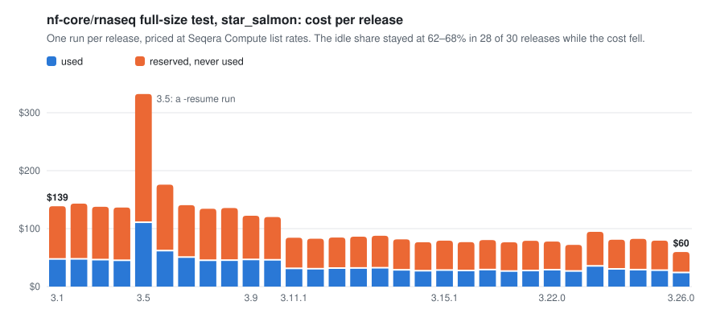
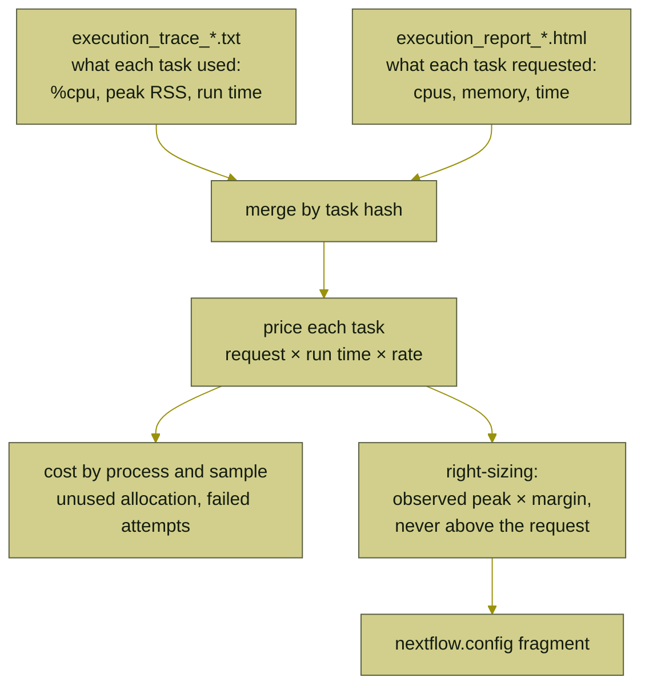
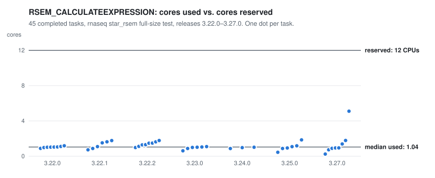

<div align="center">

<h1>
  <picture>
    <source media="(prefers-color-scheme: dark)" srcset="docs/brand/nf-audit-logo-dark.svg">
    
  </picture>
</h1>

**Where the CPU-hours and dollars of a Nextflow run actually go.**

[](https://github.com/OtoYuki/nf-audit/actions/workflows/ci.yml)
[](https://github.com/OtoYuki/nf-audit/releases/latest)
[](LICENSE)
[](Cargo.toml)

</div>

`nf-audit` reads the two files every Nextflow run already writes, `execution_trace_*.txt` and `execution_report_*.html`, and turns them into a per-process cost breakdown, an over-allocation figure, a retry-waste figure, and a right-sized `nextflow.config` fragment. It runs offline, on runs that never went through Seqera Platform; it has been run on AWS Batch and local-executor runs, and reads the same two files any executor writes. A `compare` mode lines up many runs, for example every release of a pipeline, and shows which processes carry the cost over time.

<picture>
  <source media="(prefers-color-scheme: dark)" srcset="docs/img/salmon-cost-dark.svg">
  
</picture>

<sub>nf-audit's own output on 30 public nf-core/rnaseq test runs, drawn by <code>scripts/readme_figures.rs</code> and checked against the data in CI. Details in <a href="examples/README.md"><code>examples/</code></a>.</sub>

## Contents

- [Quick start](#quick-start)
- [What you get](#what-you-get)
- [How it works](#how-it-works)
- [Install](#install)
- [Usage](#usage)
- [What it reads](#what-it-reads)
- [Cost model](#cost-model)
- [Right-sizing](#right-sizing)
- [Cost by task tag](#cost-by-task-tag)
- [Examples](#examples)
- [Checking the numbers](#checking-the-numbers)
- [Status](#status)
- [Roadmap](#roadmap)

## Quick start

A static Linux x86_64 binary, no dependencies:

```
curl -sSLO https://github.com/OtoYuki/nf-audit/releases/download/v0.2.0/nf-audit-v0.2.0-x86_64-unknown-linux-musl.tar.gz
tar xzf nf-audit-v0.2.0-x86_64-unknown-linux-musl.tar.gz
cd nf-audit-v0.2.0-x86_64-unknown-linux-musl

./nf-audit inspect  results/pipeline_info/execution_report_2024-09-16_16-33-21.html
./nf-audit analyze  --trace  results/pipeline_info/execution_trace_2024-09-16_16-33-21.txt \
                    --report results/pipeline_info/execution_report_2024-09-16_16-33-21.html \
                    --config-out nf-audit.config > report.md
./nf-audit compare  runs/*/pipeline_info/execution_report_*.html > releases.md   # one report per run
```

## What you get

From `analyze` on the nf-core/rnaseq 3.15.1 full-size test ([full report](examples/rnaseq-3.15.1-star_salmon.md)):

<!-- sample:examples/rnaseq-3.15.1-star_salmon.md (each line is checked against that file by tests/readme.rs) -->
| metric | value |
|---|---|
| cost (requested × run time) | $79.23 |
| of which allocated but unused | $52.08 (66% of the $79.23 metered) |
| the same run at other rates | $17.75 at `aws-m5-ondemand`, $6.21 at `aws-m5-spot` |
| CPU-hours requested / used | 316.9 / 130.0 (41%) |

| process | tasks | run time | cost | share | cpu eff | mem eff | waste | retries | failed |
|---|---:|---:|---:|---:|---:|---:|---:|---:|---:|
| STAR_ALIGN_IGENOMES | 8 | 6.4h | $19.28 | 24% | 47% | 50% | $9.88 | 0 | 0 |
| QUALIMAP_RNASEQ | 8 | 12.0h | $18.00 | 23% | 16% | 14% | $15.37 | 0 | 0 |
| TRIMGALORE | 8 | 4.5h | $13.49 | 17% | 61% | 8% | $9.49 | 0 | 0 |

| process | cpus now → new | memory now → new | time now → new | est. saving |
|---|---:|---:|---:|---:|
| QUALIMAP_RNASEQ | 6 → 2 | 36 GB → 7 GB | 8h → 3h | $13.50 |
<!-- /sample -->

- **Cost by process and by sample** (the task tag), with CPU and memory efficiency, unused allocation, retries and failed-attempt cost.
- **A right-sized `nextflow.config` fragment** that lowers only what the observed peaks allow and leaves alone any process that needed its retry escalation. It is checked in real Nextflow in CI.
- **`compare`**: every run side by side, and each process's share of cost across runs.
- **`--json`** for all of it.

## How it works



nf-core's default trace has no request columns, so the report is what turns usage into cost; see [What it reads](#what-it-reads).

## Install

Build from source (Rust 1.88 or newer):

```
git clone https://github.com/OtoYuki/nf-audit
cd nf-audit
cargo build --release
./target/release/nf-audit --help
```

Or download the Linux x86_64 binary from [Releases](https://github.com/OtoYuki/nf-audit/releases/latest) and check it against the published `.sha256`. From v0.2.0 it is statically linked (musl), so it runs on any x86_64 Linux, including CentOS 7 and RHEL 8 cluster nodes; the v0.1.0 binary needed glibc 2.34 and predates the fixes described under [Status](#status).

## Usage

Three subcommands. All read files Nextflow already wrote; none of them talk to a running pipeline or to Seqera Platform.

**`inspect <trace-or-report>`** — what a file actually contains before committing to `analyze`: trace columns, or the report's embedded task count and how many tasks carry requests vs. usage metrics.
- `--json` — inspection facts as JSON.

**`analyze [--trace PATH] [--report PATH]`** — price and right-size one run. At least one of `--trace` / `--report` is required; both together give the most accurate report (see [What it reads](#what-it-reads)).
- `--rates PRESET` — `seqera-compute` (default) | `aws-m5-ondemand` | `aws-m5-spot`
- `--cpu-hour USD`, `--gib-hour USD` — override the preset's per-resource price
- `--margin FLOAT` — safety margin applied to observed peaks when recommending new requests (default `1.25`, at least `1`)
- `--config-out PATH` — write a right-sized `nextflow.config` fragment there
- `--top N` — processes shown per table (default `25`)
- `--json` — the full report as JSON instead of Markdown

**`compare <report>...`** — line up several runs (one `execution_report_*.html` each): per-run totals and a process-by-run cost-share matrix.
- same `--rates` / `--cpu-hour` / `--gib-hour` as `analyze`
- `--top N` — rows in the process-share matrix (default `15`)

## What it reads

**The report HTML matters more than the trace.** nf-core pipelines enable `trace {}` without custom `fields`, so the TSV trace has only the 14 default columns: what each task *used* (`%cpu`, `peak_rss`, `realtime`) but not what it *requested* (`cpus`, `memory`, `time`). Billing follows the request. The execution report embeds a `window.data` JSON blob with the full per-task record including the requests, so `--report` is what turns "usage" into "cost". When both are given, the report's exact values (milliseconds, bytes) replace the trace's rounded ones and any task present in only one file is kept.

Trace-only input still works; the report then prices *used* resources and labels the total as a floor.

**Some runs carry no usage metrics at all.** Nextflow collects `%cpu` and `peak_rss` with `ps` inside the task container; a container without procps leaves every one of them `-`, and some runs record none for reasons the files don't state. nf-audit then still prices the run exactly (cost follows the request) but reports efficiency, waste and right-sizing as unknown rather than as zero. `inspect` tells you up front how many tasks are metered. Of the nf-core/rnaseq megatest runs, the June 2025 ones (Nextflow 25.04.2, Fusion 2.4) are unmetered. In the other 61 runs behind the tables, every completed task carries metrics; the tasks without them (at most 13 in a run) are failed or aborted attempts. Each metric is used only where it was recorded: a task with `%cpu` but no `peak_rss` counts towards CPU efficiency and says nothing about memory.

## Cost model

Cost per task = `cpus_requested × realtime_h × cpu_hour + memory_requested_GiB × realtime_h × gib_hour`.

Presets:

- `seqera-compute`: $0.10 per CPU-hour plus $0.025 per GiB-hour, Seqera Compute's published list price (seqera.io/pricing, Sept 2026). These are Seqera Compute's published per-resource rates; applying them to requested resources on `realtime` is nf-audit's model, not a statement of how that service bills.
- `aws-m5-ondemand`, `aws-m5-spot`: m5.large on-demand in us-east-1 ($0.096/h) split into per-vCPU and per-GiB components ($0.032 + $0.004), and the same at an assumed 65% spot discount. Approximations; override with `--cpu-hour` / `--gib-hour` for your region and family.

Two numbers price any executor that bills on allocation. The presets differ by about 13× on the same run, so quote the preset with the number; `analyze` prints the run at every preset under Totals for that reason. The unused share moves only slightly between them (rnaseq 3.15.1: 66% on `seqera-compute`, 64% on the m5 presets).

`CACHED` tasks (a `-resume` run) are priced at the run time recorded for them, which is what the original run spent on them, not what this run spent; `analyze` shows their share on its own row and `compare` counts them in the tasks column.

"Unused" is the dollar value of allocation that was never used (requested minus used, integrated over run time), computed over the tasks that have usage metrics. "Failed cost" is what was spent on attempts that did not complete.

### How this differs from Seqera Platform's estimate

Platform's per-task estimate is `VM hourly rate × max(task cpus / VM cpus, task memory / VM memory) × (complete − start)`: it charges the dominant resource of the actual instance type at that instance's price, on task wall time (complete − start), and by Seqera's own note it excludes storage, network and head-job costs, and how tasks are mapped to VMs (docs.seqera.io/platform-cloud/monitoring/cloud-costs). nf-audit charges CPU and memory additively at a flat rate on `realtime`. For nf-core/rnaseq 3.15.1 `test_full`, Seqera's documentation gives $34.90 for its own run on AWS Batch with Fusion and fast instance storage ($58.40 on plain S3); nf-audit's `seqera-compute` preset gives $79.23 and `aws-m5-spot` gives $6.21. Together the presets bracket the Platform figure ($79.23 above, $6.21 below); the runs, instance mix and pricing model all differ, so this is not a reconciliation. An instance-aware "dominant resource" model is on the roadmap; until then use the preset as a consistent yardstick across runs, not as an invoice.

## Right-sizing

For each process with usage metrics: new request = observed peak × margin (default 1.25, must be at least 1), rounded to sane units, never above the current request, and never below 1 CPU / 1 GiB unless the current request is lower. "Current request" is the first attempt's, before any retry escalation (`memory = { 36.GB * task.attempt }` shows 36 GB, not the 72 GB of a second attempt). Time limit = max observed run time × the larger of the margin and 1.5, rounded up, again never above the current limit. `realtime` is the task's own run time; on executors where the time limit also covers staging inputs and outputs (AWS Batch counts the whole job), leave more room for I/O-heavy tasks. Processes without metrics get no recommendation. The tool shrinks over-allocation; it does not diagnose OOM kills (those appear as failed tasks, look at the `failed` column).

What "observed peak" means differs by resource. For memory it is the largest `peak_rss` of any task. For CPU it is the largest per-task *average*: Nextflow's `%cpu` is CPU time over the task's run time, so a task that is single-threaded for most of its life and briefly parallel shows as about one core.

The estimated saving re-prices the same run time at the new request. That holds for memory and for processes that were not using their extra cores. It does not hold if a process gets slower with fewer cores, which a trace cannot show.

The `--config-out` fragment writes whole GB and hours where the values are whole, and MB, minutes or seconds (rounded down) where they are not, so it never asks for more than the current request. It writes only the values it lowers; each replaces the pipeline's setting for that resource, including any retry escalation (`memory = { 8.GB * task.attempt }`), so a task that then runs out of memory retries at the same size. A process is left alone, with no line in the fragment, when some task used more than the first attempt's request (peak memory or run time), was retried at a larger request, or was killed: an exit code nf-core treats as out of resources (130–145, 104), or a failure with no exit code within 10% of its time limit (how AWS Batch records a job it stopped at its timeout). Such kills often record no metrics, so no peak would show the need. A process also gets no recommendation when fewer than half of its tasks completed with both metrics. The report lists these processes by name; for a run with no usage metrics at all it gives a one-line explanation instead, and `--json` always lists them under `not_sized`. Validate on one real run before rolling out.

## Cost by task tag

`analyze` also groups cost by the task tag, the text in parentheses after the process name (`STAR_ALIGN (H1_REP2)`). nf-core pipelines usually tag with the sample ID, so this is a per-sample cost: on the rnaseq 3.22.0 `star_rsem` megatest, the eight samples carry $31.19 to $42.45 each of a $294.25 run. The tag is whatever the pipeline author chose, though; sarek tags lanes (`HCC1395T-1`), genomic intervals and reference files as well, and each shows up as its own row. The report states what share of the cost carries a tag. Untagged tasks, which Nextflow names after their index (`MULTIQC (1)`), are grouped as untagged using the report's own `tag` field. With a default trace alone there is no tag field, so such a task shows up as tag `1`. Waste is clamped at zero per tag here and per process in the process table, so the two waste columns need not sum to the same total. The same table is in `--json` under `run.tags`.

## Examples

`examples/` holds `nf-audit`'s own output on public nf-core megatest data: `compare` tables across 30 `star_salmon` releases (3.1 → 3.26.0) and 31 `star_rsem` releases (3.1 → 3.27.0), single-run breakdowns for the release Seqera's own cost figure is for (3.15.1 `star_salmon`) and for the first `star_rsem` run after STAR moved out of the RSEM task (3.22.0), and the local RSEM thread-scaling benchmark behind the finding below. `examples/README.md` states which runs went in, which were left out and why, and what the tables show.

nf-core publishes the traces and reports of its full-size AWS test runs in a public bucket. Layout changed over time: older rnaseq runs keep one `pipeline_info/` per aligner (`aligner_star_salmon/`, `aligner_star_rsem/`), newer ones a single `pipeline_info/`. The script finds either.

```
scripts/pull-megatests.sh --list rnaseq
scripts/pull-megatests.sh rnaseq results-4053b2ec173fc0cfdd13ff2b51cfaceb59f783cb   # rnaseq 3.15.1 test_full, 8 full-size samples, metered
scripts/pull-megatests.sh rnaseq results-0bb032c1e3b1e1ff0b0a72192b9118fdb5062489   # rnaseq 3.19.0, unmetered; both aligner runs failed on a QUALIMAP task
scripts/pull-megatests.sh sarek results-dev
```

Anchor to reconcile against: Seqera's published figure for nf-core/rnaseq **3.15.1** `test_full` on AWS Batch is $34.90 with Fusion and $58.40 on plain S3 (docs.seqera.io/platform-cloud/getting-started/rnaseq); the guide does not state the instance types, region or pricing behind those figures. That run is Seqera's own, not a megatest, but the megatest 3.15.1 `star_salmon` run (`-profile test_full_aws`, the same 8 full-size samples the guide uses) completed in 5h 8m 46s with 316.9 CPU-hours, which is the number Nextflow itself prints in the report header and which `nf-audit` reproduces exactly.

**One finding from this corpus was filed upstream.** `RSEM_CALCULATEEXPRESSION` requests 12 CPUs / 72 GiB / 16 h and, across the 45 completed tasks from 3.22.0 onward, used a median 1.04 cores. The full-size test of four of the five releases from 3.22.1 to 3.25.0 (all but 3.22.2) failed on that 16 h limit. Filed as [nf-core/rnaseq#1957](https://github.com/nf-core/rnaseq/issues/1957) (2026-09-25); the maintainer confirmed the analysis and opened [#1959](https://github.com/nf-core/rnaseq/pull/1959) (memory 16 GB, time 24 h, drop the unused BAM output). Both open as of 2026-09-27.

<picture>
  <source media="(prefers-color-scheme: dark)" srcset="docs/img/rsem-cores-dark.svg">
  
</picture>

## Checking the numbers

Every figure this README and `examples/` quote about the megatest data is recomputed from the raw files by a test, and every file under `examples/` is regenerated by a script and compared byte for byte:

```
cargo test                                         # unit tests, and the rsem-threads figures
scripts/pull-megatests.sh --corpus                 # the 109 input files (~367 MB), checked against examples/corpus.sha256
scripts/regen-examples.sh --check                  # examples/ and the README figures in docs/img/ regenerate unchanged
cargo test --release --test corpus -- --ignored    # tests/corpus.rs: each quoted number, from the raw reports
```

`scripts/e2e-nextflow.sh` closes the loop in real Nextflow (25.04.8, local executor, via podman or docker): it runs `testdata/nextflow-local/main.nf`, audits the run, applies the generated fragment with `-c`, and checks from the new trace that the lowered requests took effect and that a process relying on retry escalation kept it.

CI runs all of these on every push to `main`, on every pull request, and weekly (the weekly run downloads the corpus afresh, so it also notices if the bucket stops serving a file), so a change that moves a published number fails the build until the text is corrected. Figures whose source is outside the data (Seqera's documentation, AWS prices, nf-core pull requests, the FASTQ volume) are cited where they are used and are not checked automatically.

## Status

v0.1, Sept 2026. Parsers are unit-tested against Nextflow's formatting and have been run against 61 rnaseq megatest runs (30 releases on `star_salmon`, 3.1 to 3.26.0; 31 on `star_rsem`, 3.1 to 3.27.0; Nextflow 21.04 to 26.04), the two unmetered 3.19.0 runs and sarek `results-dev`; on all 61 rnaseq runs the requested CPU-hours match the figure in the report header to within 0.05. Two things learned from real files that the synthetic fixtures did not show: the report's own script references `window.data_byprocess`, `window.data.summary` and `window.data.trace` before the assignment, and every task's `script` field carries JavaScript-only `\'` escapes, so the blob is not valid JSON until they are rewritten. Report-JSON conventions follow Nextflow's `ReportObserver.renderJsonData` (every `TraceRecord.FIELDS` entry as a JSON string: memory in bytes, time in milliseconds, `%cpu` as a float, `cpus` as an integer string). A report with more than `maxTasks` tasks (default 10,000) embeds `"trace": null`; nf-audit says so and points you at a trace configured with `trace.fields`.

Changes since the v0.1.0 binary, found by checking every published figure against the code and data: merging a trace with its report no longer counts a task twice when the trace logs its hash twice, or matches a trace row to a retry of the same task; the config fragment no longer rounds memory or time up past the current request (it writes MB, minutes or seconds where needed); a task with only one of `%cpu` / `peak_rss` no longer reads as zero use of the other; a task with a `cpus` but no `memory` request (a process without a `memory` directive) is priced on its CPU request instead of entirely on use; trace-only input shows waste and requests as unknown instead of $0.00; cached tasks are counted and labelled; right-sizing compares against the first attempt's request; untagged tasks no longer show as tag `1` when a report is given; right-sizing leaves alone a process whose tasks used more than the first attempt's request, were retried at a larger one, or were killed (rnaseq 3.5 `PICARD_MARKDUPLICATES` peaked at 53 GiB on retries of a 36 GiB request; rnaseq 3.9 `PRESEQ_LCEXTRAP` had two tasks killed with exit 137 at 6 GB and would otherwise have been cut to 4 GB; a task stopped at its timeout with no exit code counts as killed), a process where fewer than half the tasks completed with metrics is not sized, and the config fragment writes only the values it lowers, including a lower time limit on its own; a trace written without a `hash` column is matched to its report by name and deduplicated by `task_id`; a report passed as `--trace` is rejected; short process names are widened until unique (sarek's germline and somatic `CNVKIT_BATCH` no longer share a row); `compare` places branch runs (`master`) by date with their commit; `inspect` counts a trace's tasks the way `analyze` does. None of the costs, shares, efficiencies or savings quoted in these docs moved. In `examples/`: the Totals row "billed cost" is now "cost (requested × run time)"; untagged tasks formerly shown as tag `1` joined the untagged row (so "Tagged tasks carry" reads 99.9% instead of 100.0% for 3.15.1); cached tasks are counted; `compare` rows were reordered and relabelled; and the config fragments no longer repeat unchanged values but do include time-only cuts.

## Roadmap

- Instance-aware pricing (Seqera's dominant-resource formula against an instance table; `start`/`complete` timestamps instead of `realtime`).
- Retry attribution: cost of spot reclamation vs genuine failures.
- Time limits that grow as well as shrink: today right-sizing never raises a request, so it keeps a time limit that tasks are running into (rnaseq `star_rsem` 3.22.1 and 3.23.0–3.25.0 failed on RSEM's 16 h limit).
- CSV output for dashboards (JSON exists: `--json`).

MIT. Author: Sushant Hona.
